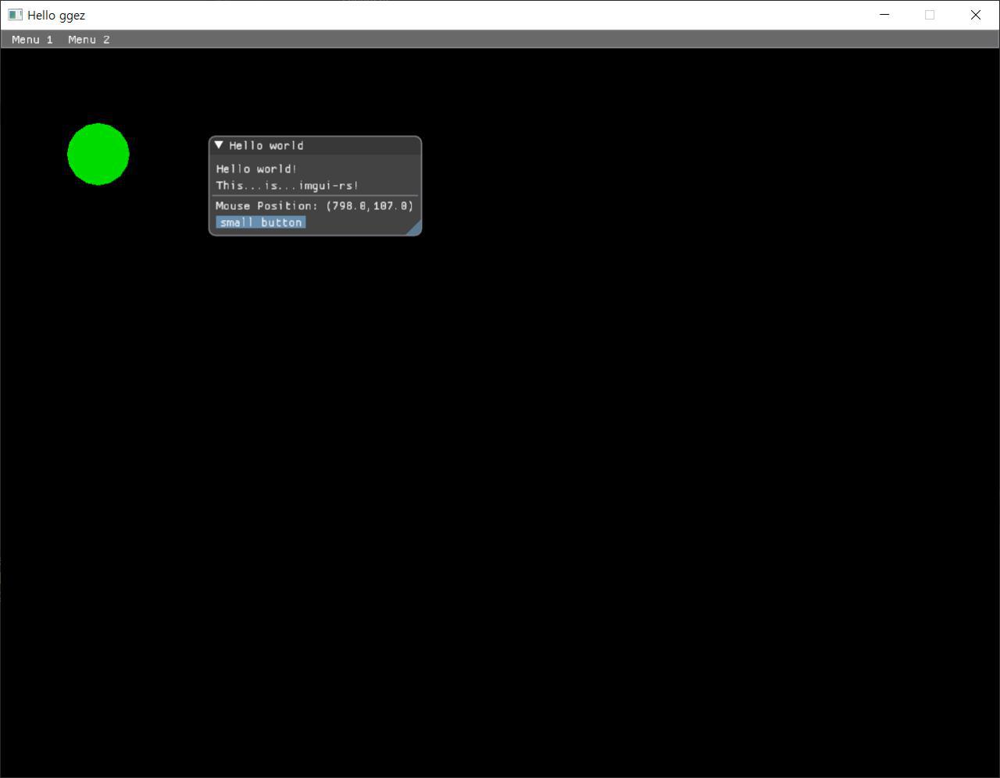

# hello-ggez

Basic [ggez](https://github.com/ggez/ggez) project with dear [imgui](https://github.com/Gekkio/imgui-rs).  
Based on [imgui-ggez-starter](https://github.com/iolivia/imgui-ggez-starter).

